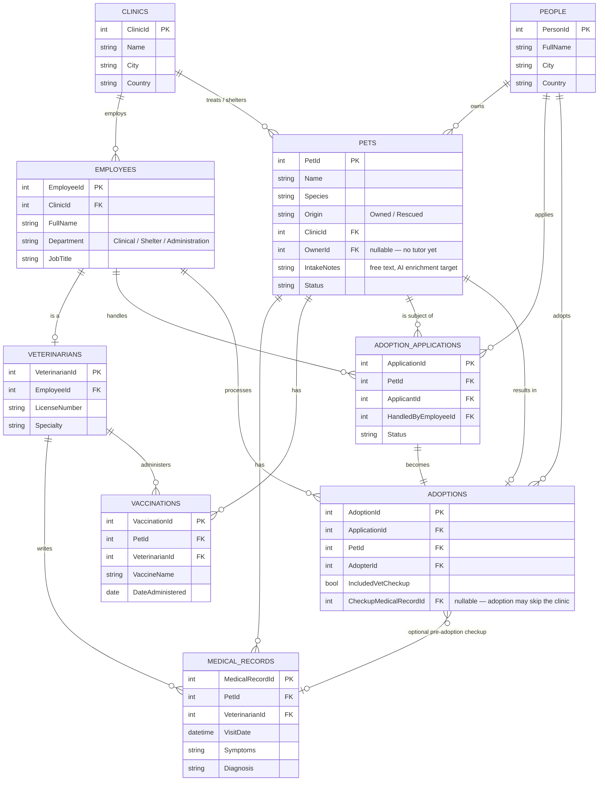
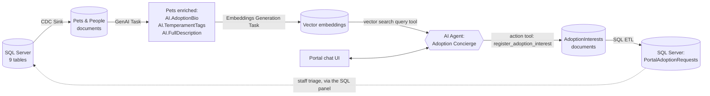

# 🐾 RavenDB CDC Demo — Vet Clinic & Shelter

**🇧🇷 Leia em português: [README.pt-BR.md](README.pt-BR.md)**

> **TL;DR** — SQL Server keeps doing its job, untouched. RavenDB's **CDC Sink** quietly streams every change into well-shaped documents next door, where AI turns raw notes into pet bios, vector search finds "a calm dog good with kids," and an AI Agent can register a real adoption lead that flows all the way back into SQL Server. Two databases, one story, zero rewrites of the legacy app.

> 💰 **Before you clone this — what it actually costs:** RavenDB's free **Developer license** already unlocks every Enterprise feature this demo uses (CDC Sink included) for local testing — you don't need to buy anything just to try it out. The one real cost is the AI side: by default, GenAI/Embeddings/the Agent call OpenAI, so running the full pipeline spends a few cents in real tokens each time. Don't want to spend anything? RavenDB's AI integration also supports self-hosted models via [Ollama](https://ollama.com) — you'd configure that connection string by hand in RavenDB Studio instead of pasting an OpenAI key into the [connection modal](#-point-this-at-your-own-servers) (which only automates OpenAI provisioning today).

## 👋 About me

Hi, I'm **Lucas Tavares**, a Technical Solutions Consultant at [RavenDB](https://ravendb.net). I spend my days helping teams figure out how a document database fits into systems that already work — not instead of them.

This repo is the companion piece to an article I'm writing around one simple idea. Read on. 👇

## 💡 The idea: RavenDB *on top*

You don't have to rip out a working relational database to get RavenDB's benefits — flexible documents, native vector search, AI-powered enrichment, a much friendlier query experience for modern apps.

**Change Data Capture (CDC)** is the trick: keep SQL Server (or PostgreSQL, or MySQL) exactly as it is — the system of record, fed by whatever legacy app already writes to it — while RavenDB's [CDC Sink](https://docs.ravendb.net/7.2/server/ongoing-tasks/cdc-sink/overview) continuously reads the change stream and reshapes your normalized tables into denormalized, well-modeled documents. New apps, new frontends, new AI features get built against RavenDB, in parallel, without anyone touching a line of the legacy stack.

To make that concrete instead of abstract, this demo picks a domain everyone can relate to, wherever you're reading this from: a 🏥 **veterinary clinic that also runs a pet shelter and adoption program.**

## 🖥️ What you actually get

One split-screen web app, two very different personalities on purpose:

| 🩺 Left — the legacy system | 🐕 Right — RavenDB |
|---|---|
| Plain CRUD against SQL Server: register patients, log visits, manage shelter intake and adoptions | A live adoption portal: dashboard, charts, AI-written pet bios |
| Point it at *your own* SQL Server via a connection modal | Natural-language ("semantic") pet search |
| Old-school forms — search, filter, save, done | A chat-based AI concierge that can register a real adoption lead |

The legacy app still owns the source of truth — nothing about how it works changes. The one deliberate exception: when a visitor registers interest in a pet through the RavenDB-powered portal, that flows *back* into SQL Server too (via SQL ETL). RavenDB sitting on top of a legacy system isn't a one-way street here — it's proven in both directions.

> ✅ **Status:** everything below is built and working, right now — SQL Server schema, CDC Sink, GenAI enrichment, embeddings, the AI Agent, the SQL ETL write-back, both halves of the web app, and the "point this at your own servers" provisioning flow. Nothing in this README is aspirational.

## 🗂️ The data model

<details>
<summary><strong>Clinics, staff, pets, medical records, adoptions — click to see the full ERD</strong></summary>

A clinic employs staff, some of whom are licensed veterinarians. Pets belong to the clinic and may (or may not, yet) have a tutor. Every pet accumulates a medical history. Rescued pets flow through an adoption pipeline that may or may not include a pre-adoption vet checkup.



| Table | Purpose |
|---|---|
| `Clinics` | The clinic location(s) running both the practice and the shelter. |
| `Employees` | Everyone on staff — vets, rescue coordinators, caretakers, adoption coordinators — distinguished by `Department` and `JobTitle`. |
| `Veterinarians` | 1:1 extension of `Employees` for staff licensed to practice. |
| `People` | Anyone outside clinic staff: pet tutors and/or adoption applicants — the same person can be both. |
| `Pets` | Every animal the clinic knows about — a paying client's pet (`Owned`) or a rescue (`Rescued`). `IntakeNotes` is the free text that later becomes an AI-generated adoption bio. |
| `MedicalRecords` | Every clinical visit — checkups, intake exams, treatments. |
| `Vaccinations` | Vaccine history per pet, separate from general visits. |
| `AdoptionApplications` | A person's application to adopt a pet: `Pending → UnderReview → Approved/Rejected`. |
| `Adoptions` | The finalized adoption — with an optional pre-adoption vet checkup, modeled as a nullable FK. |

This is deliberately relational — foreign keys, a 1:1 extension, an optional link — so CDC Sink's [document modeling](https://docs.ravendb.net/7.2/server/ongoing-tasks/cdc-sink/document-modeling/schema-design) (tables → collections, links → references, embeds → nested arrays) has something real to transform.

</details>

## 🚀 Getting started

### What you'll need

- [Docker Desktop](https://www.docker.com/products/docker-desktop/) (Windows 10/11 with WSL2)
- [PowerShell](https://learn.microsoft.com/en-us/powershell/) for the setup script
- [Node.js](https://nodejs.org) 18+ for the web app
- A RavenDB server, 7.2+, **Enterprise license** (CDC Sink is Enterprise-only) — needed a bit later, not for step 1

### 1️⃣ Run SQL Server in Docker

```powershell
docker pull mcr.microsoft.com/mssql/server:2022-latest

docker run -d `
  --name sqlserver2022 `
  -e "ACCEPT_EULA=Y" `
  -e "MSSQL_SA_PASSWORD=<choose-a-strong-password>" `
  -e "MSSQL_PID=Developer" `
  -e "MSSQL_AGENT_ENABLED=true" `
  -p 1433:1433 `
  mcr.microsoft.com/mssql/server:2022-latest
```

> 💬 SQL Server's **Developer** edition is free for dev/test and includes every Enterprise feature, CDC included. `MSSQL_AGENT_ENABLED=true` matters later — the SQL Server Agent runs the CDC capture jobs. Password needs upper case, lower case, a digit, and a special character.

Give it ~15 seconds, then check it's up:

```powershell
docker ps --filter "name=sqlserver2022"
```

### 2️⃣ Create and seed the database

[`/sql`](sql) has the DDL; [`/data/csv`](data/csv) has the seed data as plain CSVs — one per table, so you can poke at them before importing.

```powershell
$env:CDC_DEMO_SA_PASSWORD = "<the-password-you-chose-above>"
./scripts/Setup-Database.ps1
```

This copies everything into the container and runs it through `sqlcmd`: creates `CDC_Demo`, creates the schema, bulk-imports every CSV in dependency order.

### 3️⃣ Sanity check

```powershell
docker exec sqlserver2022 /opt/mssql-tools18/bin/sqlcmd `
  -S localhost -U sa -P "<the-password-you-chose-above>" -No `
  -Q "USE CDC_Demo; SELECT COUNT(*) AS Pets FROM dbo.Pets;"
```

You should see `15`. 🐕🐈🐇

### 4️⃣ Flip on CDC

Requires `MSSQL_AGENT_ENABLED=true` from step 1.

```powershell
docker cp sql/04-enable-cdc.sql sqlserver2022:/tmp/sql/04-enable-cdc.sql
docker exec sqlserver2022 /opt/mssql-tools18/bin/sqlcmd `
  -S localhost -U sa -P "<the-password-you-chose-above>" -No `
  -i /tmp/sql/04-enable-cdc.sql
```

This runs `sp_cdc_enable_db` + `sp_cdc_enable_table` for every table and prints `is_tracked_by_cdc = 1` for all 9. Want proof it's really live?

```powershell
docker exec sqlserver2022 /opt/mssql-tools18/bin/sqlcmd `
  -S localhost -U sa -P "<the-password-you-chose-above>" -No `
  -Q "USE CDC_Demo; UPDATE dbo.Pets SET Status = 'InShelter' WHERE PetId = 13; SELECT [__\$operation], PetId, Status FROM cdc.dbo_Pets_CT;"
```

Two rows come back (operation `3` = before, `4` = after) — that's the exact stream CDC Sink reads.

### 5️⃣ Run the web app

Copy the env template and drop in your password:

```bash
cp web/.env.example web/.env
```

Then:

```bash
start.bat
```

This kills any previous instance on the port, installs npm packages on first run, starts the server, and opens `http://localhost:4000` in your browser the moment it responds. `Ctrl+C` to stop (cmd.exe will ask you to confirm).

**That's it — no manual RavenDB Studio setup required.** On every boot, the app itself creates the CDC Sink task, the GenAI/Embeddings tasks, the SQL ETL task, the AI Agent, and a dashboard index — see "Zero manual setup" further down.

## 🌐 Tour of the app

The two panels are deliberately styled after their real-world counterparts, so it's obvious at a glance you're looking at two different systems: the **SQL Server panel** borrows Microsoft's own look (Segoe UI, Microsoft blue), and the **RavenDB panel** — plus the shared header/footer — borrows RavenDB's brand (Figtree, the blue-to-purple gradient, dark navy, the real logo).

Each panel has a live status footer (host/URL, database, table/collection count, a green/red dot) and a short "Learn more" blurb up top.

### 🩺 The SQL Server panel

A small, generic admin UI driven by one config file ([`web/schema/tables.js`](web/schema/tables.js)) — no per-table code anywhere:

- 📖 A collapsible context panel explaining the domain, with a clickable row-count list per table.
- 📋 A sidebar with all 9 tables and live row counts.
- 🔍 Paginated, searchable, filterable lists — search/filters only show up where they make sense (e.g. filter by `Status` on Pets, nothing on `Adoptions`).
- 🔗 Clicking a row opens a detail view (not a modal) with N:1 references as clickable links — not raw IDs — and 1:N relations as tabs, each labeled by the FK it relates through (some tables relate to the same parent two different ways).
- ✏️ Editing is explicit: **Edit → change fields → Save/Cancel**. **Delete** confirms first. No autosave, on purpose — this is meant to feel like the classic line-of-business tool it's standing in for.
- ⏯️ A **CDC capture toggle** in the top-right corner starts/stops replication live, mid-demo, via `sys.sp_cdc_stop_job`/`start_job` — instant, no risk to the container's data.
- ⚙️ A gear icon opens the [connection settings modal](#-point-this-at-your-own-servers) — and next to it, **↺ Reset SQL Server data**, covered below.

### 🐕 The RavenDB panel: an AI-powered adoption portal

This side doesn't mirror the SQL admin grid at all — on purpose. It's a small **pet adoption portal**: a dashboard, AI-written bios, semantic search, and a chat-based "adoption concierge" that can register a real lead on a visitor's behalf, closing the loop back into SQL Server. The point: RavenDB doesn't need to replicate the whole legacy schema, only the slice that's useful for a new, customer-facing experience.

Everything here is live — a real CDC Sink task, real GenAI/Embeddings tasks calling OpenAI, a real AI Agent, a real SQL ETL write-back. Nothing mocked.

#### A deliberately incomplete data model

CDC Sink syncs **two** RavenDB collections out of nine SQL tables — that gap *is* the point:

- **`Pets`** (root): pet fields, plus `MedicalHistory`, `Vaccinations`, and `AdoptionHistory` **embedded** as arrays, and a **linked** reference to the pet's `Owner` (→ `People`).
- **`People`** (root): trimmed to just what the portal needs — name, contact, city.
- `Employees`, `Veterinarians`, `Clinics`, `Adoptions` **never become RavenDB collections** — internal clinic bookkeeping with no reason to exist in a public adoption app. `AdoptionApplications` *is* embedded, specifically so a new application created through the portal flows back and shows up right there on the pet (more on that below).

#### 🤖 The AI pipeline



1. **[GenAI Task](https://docs.ravendb.net/7.2/ai-integration/gen-ai-integration/overview)** watches `Pets`. Per document, a context script builds a small object from the pet's raw fields, sends it with a prompt + JSON schema to the model, and an update script writes the answer back — producing `AI.AdoptionBio`, `AI.TemperamentTags`, and `AI.FullDescription` (the field vector search targets). RavenDB hashes the context+prompt+schema to skip unchanged documents — that hash has to be on the pet's *source* fields, never the AI-generated ones, or it loops forever.
2. **[Embeddings Generation Task](https://docs.ravendb.net/7.2/ai-integration/generating-embeddings/embeddings-generation-task)** watches `Pets`, reads `AI.FullDescription`, stores a vector. This is what makes "a calm dog, good with kids, small breed" actually work as a search.
3. **[AI Agent](https://docs.ravendb.net/7.2/ai-integration/ai-agents/overview)** ("Adoption Concierge") — one *query tool* (vector search, restricted to pets actually available — never `Owned`/`ClinicPatient`) and one *action tool*, `register_adoption_interest`. Key fact from the docs: **the LLM never touches the database directly.** It can only request an action; the Node backend fulfills it via `chat.Handle(actionName, callback)`, registered before the conversation runs — the callback executes synchronously and can store a document right there. No webhook, no queue.

#### 🔁 Closing the loop back to SQL Server

The obvious move — have SQL ETL write a new adoption interest straight into `People` + `AdoptionApplications` — doesn't actually work: both use `IDENTITY` primary keys with a foreign key between them, and SQL ETL's `loadTo` has no way to chain two just-created `IDENTITY` values in one run.

**What happens instead:** the agent's action handler stores each interest as an `AdoptionInterests` document. One SQL ETL task, one script, two `loadTo` calls: the interest lands in a new denormalized staging table (`PortalAdoptionRequests`) *and* directly in `AdoptionApplications` (`ApplicantId = NULL`, `Source = 'Portal'`, contact details in new `External*` columns). Staff triage and "promote" a genuine lead into a real `People` row using the SQL panel already built here.

That new `AdoptionApplications` row — with its real, SQL-generated `ApplicationId` — gets picked up by CDC Sink moments later and appended to the same pet's `AdoptionHistory` array, back in RavenDB. Chat with the concierge, register interest, watch the confirmed application show up on the pet's own document. A live, two-way loop — not a one-off webhook.

#### 🔐 No login, ever

No accounts, anywhere. When a visitor wants to register interest, the chat agent just asks for name and contact **as part of the conversation** and passes it to the action tool. A browser-generated ID in `localStorage` only lets a visitor resume their own chat thread — it's not an identity system.

#### 📊 The dashboard

Four stat tiles up top (pets treated, available for adoption, last query's real duration, cumulative AI tokens spent), then charts:

- 🥧 Pie — pets by species
- 🍩 Donut — owned vs. rescued
- 📊 Bar — pets by status
- 📈 Line — live CDC activity pulse
- 🕸️ Radar — AI-generated temperament tags
- 📉 **Line — rescue-to-adoption timeline**, four series (rescues, medical visits, vaccinations, approved adoptions) aligned on one monthly axis, so you can eyeball whether a busy rescue month actually shows up later as a busy treatment month and, eventually, an adoption bump

Species/status/origin stats come from a real static map-reduce index (`Pets/StatsBySpeciesAndStatus`), not a dynamic scan — they stay fast as the dataset grows.

Up in the panel header: four independent toggles (**CDC Sink**, **GenAI**, **Embeddings**, **Adoption Concierge**) — proof that data keeps flowing through CDC even with every AI feature switched off, because enrichment is a genuinely separate, decoupled step, not baked into the sync.

#### 🧹 Resetting the demo

Two admin buttons, deliberately placed next to the toggle they affect rather than lumped together — the SQL Server panel gets the SQL reset, the RavenDB panel gets the RavenDB reset:

- **↺ Reset SQL Server data** (SQL Server panel, next to the CDC capture toggle) restores the original seed rows and turns off CDC Sink.
- **🧹 Clear RavenDB** (RavenDB panel, next to the four toggles) deletes every document and collection — including the `@`-prefixed system ones (`@embeddings/Pets`, `@embeddings-cache`, `@cdc-states`, `@conversations`) — and turns off CDC Sink, GenAI, Embeddings, and the concierge all at once.

Run both, and you're back to an empty portal. Flip CDC Sink back on and watch RavenDB **repopulate live** from SQL Server, then bring GenAI, Embeddings, and the concierge back one at a time — the "magic" happens in front of the audience, one step at a time, instead of all at once before anyone's watching.

### ⚡ Zero manual setup — the app provisions itself

On every server start, [`web/lib/ravenBootstrap.js`](web/lib/ravenBootstrap.js) idempotently creates (or updates) the SQL connection string, the CDC Sink task, GenAI + Embeddings tasks, the SQL ETL task, the AI Agent, and the dashboard index. Requires an Enterprise-licensed RavenDB 7.2+ server with AI Integration on, and (unless you provision them via the modal below) the `GenAI`/`TextEmbedding` AI connection strings already set up in Studio.

### 🔧 Point this at your own servers

Both panels have a **⚙ gear icon** in their header — a connection-settings modal that's what actually makes this demo reusable instead of tied to one Docker setup. Changes are runtime-only (nothing gets written to `.env`, so a restart reverts) — the point is trying this against a server you already have, with zero file editing.

- **SQL Server modal**: host, port, database, user, password. Tick **"provision the full environment"** and the backend creates the database (if missing), the whole schema, the original seed data, and enables CDC on every table — over a plain network connection (client-side bulk copy via the `mssql` npm package), **no `docker exec` anywhere.** Works against any reachable SQL Server, not just the bundled container.
- **RavenDB modal**: URL and database name. Tick the same checkbox and it creates the database (if missing) plus every ongoing task this demo needs — CDC Sink, GenAI, Embeddings, SQL ETL, the Agent, the index. Paste an OpenAI API key in the same modal and it'll create the two AI connection strings for you too, instead of requiring them pre-configured in Studio.

Order matters: point the SQL modal at your server *first*, then the RavenDB one — the tasks it creates reference whatever SQL connection is configured at that moment.

## 🐛 Two things that went wrong (and how they got fixed)

<details>
<summary>Worth reading if you're building your own GenAI task or hit a CDC-after-schema-change mystery</summary>

- **The GenAI update script's real convention is `this` / `$output`, not `function update(doc, result)`.** The client library's own JSDoc comment suggests the latter; it compiles, runs with zero errors, quietly marks the document as processed — and never actually writes anything. The working form matches CDC Sink/SQL ETL patch scripts elsewhere in RavenDB: plain statements against `this` (the document), reading the model's answer via `$output.<field>`.
- **SQL Server CDC doesn't notice columns added after `sp_cdc_enable_table` already ran.** Adding `Source`/`External*` to an already-CDC-enabled `AdoptionApplications` left its capture instance stuck on the old column list. Fix: `sp_cdc_disable_table` + `sp_cdc_enable_table` again for that table whenever its schema changes.

</details>

## ✅ Roadmap

- [x] SQL Server schema + seed data
- [x] Enable SQL Server CDC (`sp_cdc_enable_db` / `sp_cdc_enable_table`)
- [x] Web app scaffold: Express server, React split-screen shell, `start.bat`
- [x] Branding: Microsoft-styled SQL panel, RavenDB-styled header/footer/panel, live connection status
- [x] SQL Server panel: browse, search, filter, view, edit, insert, delete every table
- [x] **CDC Sink** task (`Pets` + `People`, embedding medical history, vaccinations, and adoption applications)
- [x] GenAI task: `Pets.IntakeNotes` → `AI.AdoptionBio` + `AI.TemperamentTags` + `AI.FullDescription`
- [x] Vector/semantic search (Embeddings Generation task + an AI Agent query tool)
- [x] RavenDB panel: adoption portal dashboard, AI Agent chat concierge, full round-trip via SQL ETL
- [x] Admin reset buttons, placed next to the feature each one resets
- [x] Rescue-to-adoption timeline chart
- [x] Connection settings modal on each panel — point the app at your own servers and provision the entire environment

## 📚 RavenDB CDC documentation

- [CDC Sink: Overview](https://docs.ravendb.net/7.2/server/ongoing-tasks/cdc-sink/overview)
- [CDC Sink for SQL Server](https://docs.ravendb.net/7.2/server/ongoing-tasks/cdc-sink/source-database-setup/sql-server/overview)
- [Creating a CDC Sink task](https://docs.ravendb.net/7.2/server/ongoing-tasks/cdc-sink/manage-cdc-sink-tasks/create-task)
- [Document modeling: schema design](https://docs.ravendb.net/7.2/server/ongoing-tasks/cdc-sink/document-modeling/schema-design)
- [Configuration reference](https://docs.ravendb.net/7.2/server/ongoing-tasks/cdc-sink/manage-cdc-sink-tasks/configuration-reference)

## 🐦‍⬛ About RavenDB

[RavenDB](https://ravendb.net) is a fully transactional, ACID document database built for high performance and ease of use — with native full-text and vector search, AI-powered features, time series, and more, out of the box.

## 🔗 Connect

- GitHub: [@leadsoftlucas](https://github.com/leadsoftlucas)
- LinkedIn: [linkedin.com/in/lucasrtavares](https://www.linkedin.com/in/lucasrtavares/)
