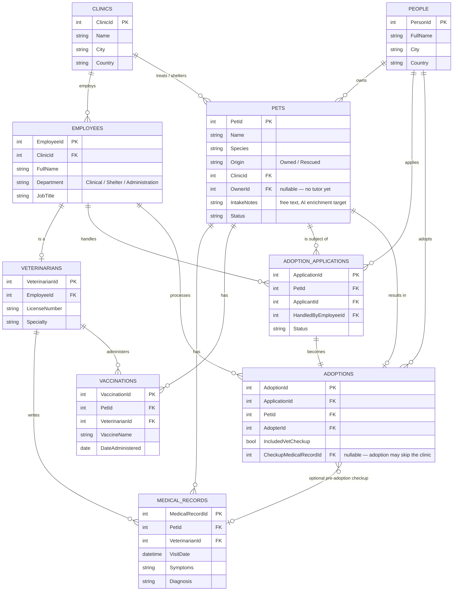
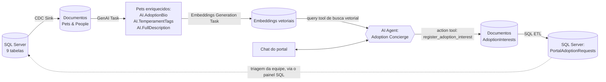

# 🐾 RavenDB CDC Demo — Clínica Veterinária & Abrigo

**🇺🇸 Read in English: [README.md](README.md)**

> **Resumo** — o SQL Server continua fazendo o trabalho dele, sem mudar nada. O **CDC Sink** do [RavenDB](https://ravendb.net) fica silenciosamente replicando cada mudança em documentos bem modelados logo ao lado, onde a IA transforma anotações cruas em bios de pets, a busca vetorial encontra "um cachorro calmo, bom com crianças", e um AI Agent consegue registrar um lead de adoção de verdade que volta inteiro pro SQL Server. Dois bancos, uma história só, zero reescrita da aplicação legada.

> 💰 **Antes de clonar isso — quanto custa de verdade:** a licença gratuita de **Developer** do [RavenDB](https://ravendb.net) já libera todo recurso Enterprise que essa demo usa (CDC Sink incluído) pra teste local — você não precisa comprar nada só pra experimentar. O custo real está no lado da IA: por padrão, GenAI/Embeddings/o Agent chamam a OpenAI, então rodar o pipeline completo gasta uns centavos em tokens de verdade a cada execução. Não quer gastar nada? A integração de IA do [RavenDB](https://ravendb.net) também suporta modelos self-hosted via [Ollama](https://ollama.com) — nesse caso você configura essa connection string manualmente no RavenDB Studio, em vez de colar uma chave da OpenAI no [modal de conexão](#-aponte-isso-pros-seus-próprios-servidores) (que hoje só automatiza o provisionamento via OpenAI).

## 👋 Sobre mim

Oi, eu sou o **Lucas Tavares**, Technical Solutions Consultant na [RavenDB](https://ravendb.net). Passo meus dias ajudando times a entender como um banco de dados orientado a documentos se encaixa em sistemas que já funcionam — não no lugar deles. Esse é um recorte desse trabalho: eu crio demos pra todo tipo de problema — essa aqui só por acaso é sobre CDC.

Este repositório é a peça complementar de um artigo que escrevi em torno de uma ideia simples — **[leia no LinkedIn](https://www.linkedin.com/pulse/ningu%C3%A9m-te-disse-que-d%C3%A1-pra-ter-ia-sem-migrar-seu-de-resende-tavares-jrzxf)** pra história completa, ou continue lendo aqui pro mergulho técnico. 👇

## 💡 A ideia: RavenDB *por cima*

Você não precisa arrancar um banco relacional que já funciona pra ter os benefícios do [RavenDB](https://ravendb.net) — documentos flexíveis, busca vetorial nativa, enriquecimento por IA, uma experiência de consulta bem mais amigável pra aplicações modernas.

**Change Data Capture (CDC)** é o truque: mantenha o SQL Server (ou PostgreSQL, ou MySQL) exatamente como está — o sistema de registro, alimentado por qualquer aplicação legada que já escreve nele — enquanto o [CDC Sink](https://docs.ravendb.net/7.2/server/ongoing-tasks/cdc-sink/overview) do [RavenDB](https://ravendb.net) lê continuamente o stream de mudanças e transforma suas tabelas normalizadas em documentos desnormalizados e bem modelados. Novas aplicações, novos frontends, novos recursos de IA são construídos contra o [RavenDB](https://ravendb.net), em paralelo, sem ninguém tocar em uma linha sequer da stack legada.

Pra tornar isso concreto em vez de abstrato, essa demo escolhe um domínio que todo mundo entende, não importa de onde você está lendo isso: uma 🏥 **clínica veterinária que também mantém um abrigo e um programa de adoção de pets.**

## 🖥️ O que você realmente ganha

Uma aplicação web de tela dividida, com duas personalidades bem diferentes de propósito:

| 🩺 Esquerda — o sistema legado | 🐕 Direita — RavenDB |
|---|---|
| CRUD simples no SQL Server: cadastrar pacientes, registrar consultas, gerenciar entrada no abrigo e adoções | Um portal de adoção ao vivo: dashboard, gráficos, bios de pets escritas por IA |
| Aponte pro *seu próprio* SQL Server via um modal de conexão | Busca de pets em linguagem natural ("semântica") |
| Formulários à moda antiga — buscar, filtrar, salvar, pronto | Um concierge de IA via chat que consegue registrar um lead de adoção de verdade |

A aplicação legada continua sendo a fonte da verdade — nada em como ela funciona muda. A única exceção, deliberada: quando um visitante registra interesse num pet através do portal alimentado pelo [RavenDB](https://ravendb.net), isso também volta pro SQL Server (via SQL ETL). [RavenDB](https://ravendb.net) rodando por cima de um sistema legado não é uma via de mão única aqui — está provado nas duas direções.

> ✅ **Status:** tudo abaixo está construído e funcionando, agora mesmo — schema do SQL Server, CDC Sink, enriquecimento por GenAI, embeddings, o AI Agent, a escrita de volta via SQL ETL, as duas metades da aplicação web, e o fluxo de provisionamento "aponte isso pros seus próprios servidores". Nada neste README é aspiracional.

## 🗂️ O modelo de dados

<details>
<summary><strong>Clínicas, funcionários, pets, prontuários, adoções — clique pra ver o ERD completo</strong></summary>

Uma clínica emprega funcionários, alguns dos quais são veterinários licenciados. Pets pertencem à clínica e podem (ou ainda não) ter um tutor. Todo pet acumula um histórico médico. Pets resgatados passam por um pipeline de adoção que pode ou não incluir uma consulta veterinária antes.



| Tabela | Propósito |
|---|---|
| `Clinics` | A(s) clínica(s) que roda(m) tanto a prática quanto o abrigo. |
| `Employees` | Todo mundo do time — vets, coordenadores de resgate, cuidadores, coordenadores de adoção — diferenciados por `Department` e `JobTitle`. |
| `Veterinarians` | Extensão 1:1 de `Employees` pra quem é licenciado pra praticar. |
| `People` | Qualquer um fora do time da clínica: tutores de pets e/ou candidatos a adoção — a mesma pessoa pode ser as duas coisas. |
| `Pets` | Todo animal que a clínica conhece — o pet de um cliente pagante (`Owned`) ou um resgate (`Rescued`). `IntakeNotes` é o texto livre que depois vira uma bio de adoção gerada por IA. |
| `MedicalRecords` | Toda visita clínica — checkups, exames de entrada, tratamentos. |
| `Vaccinations` | Histórico de vacinas por pet, separado das visitas gerais. |
| `AdoptionApplications` | A candidatura de uma pessoa pra adotar um pet: `Pending → UnderReview → Approved/Rejected`. |
| `Adoptions` | A adoção finalizada — com um checkup veterinário opcional antes, modelado como FK anulável. |

Isso é deliberadamente relacional — foreign keys, uma extensão 1:1, um link opcional — pra que a [modelagem de documentos](https://docs.ravendb.net/7.2/server/ongoing-tasks/cdc-sink/document-modeling/schema-design) do CDC Sink (tabelas → coleções, links → referências, embeds → arrays aninhados) tenha algo de verdade pra transformar.

</details>

## 🚀 Começando

### O que você vai precisar

- [Docker Desktop](https://www.docker.com/products/docker-desktop/) (Windows 10/11 com WSL2)
- [PowerShell](https://learn.microsoft.com/en-us/powershell/) pro script de setup
- [Node.js](https://nodejs.org) 18+ pra aplicação web
- Um [servidor RavenDB, 7.2+](https://ravendb.net/download), com **licença Enterprise** (CDC Sink é recurso Enterprise) — necessário um pouco mais adiante, não pro passo 1

### 1️⃣ Rode o SQL Server no Docker

```powershell
docker pull mcr.microsoft.com/mssql/server:2022-latest

docker run -d `
  --name sqlserver2022 `
  -e "ACCEPT_EULA=Y" `
  -e "MSSQL_SA_PASSWORD=<escolha-uma-senha-forte>" `
  -e "MSSQL_PID=Developer" `
  -e "MSSQL_AGENT_ENABLED=true" `
  -p 1433:1433 `
  mcr.microsoft.com/mssql/server:2022-latest
```

> 💬 A edição **Developer** do SQL Server é gratuita pra dev/test e inclui todo recurso Enterprise, CDC incluído. `MSSQL_AGENT_ENABLED=true` importa mais adiante — o SQL Server Agent é quem roda os jobs de captura do CDC. A senha precisa de maiúscula, minúscula, dígito e caractere especial.

Espere uns 15 segundos, depois confira se subiu:

```powershell
docker ps --filter "name=sqlserver2022"
```

### 2️⃣ Crie e popule o banco

[`/sql`](sql) tem o DDL; [`/data/csv`](data/csv) tem os dados de seed em CSV puro — um por tabela, pra você poder olhar antes de importar.

```powershell
$env:CDC_DEMO_SA_PASSWORD = "<a-senha-que-voce-escolheu>"
./scripts/Setup-Database.ps1
```

Isso copia tudo pro container e roda via `sqlcmd`: cria o `CDC_Demo`, cria o schema, importa cada CSV em ordem de dependência.

### 3️⃣ Confira se deu certo

```powershell
docker exec sqlserver2022 /opt/mssql-tools18/bin/sqlcmd `
  -S localhost -U sa -P "<a-senha-que-voce-escolheu>" -No `
  -Q "USE CDC_Demo; SELECT COUNT(*) AS Pets FROM dbo.Pets;"
```

Você deve ver `15`. 🐕🐈🐇

### 4️⃣ Ligue o CDC

Requer `MSSQL_AGENT_ENABLED=true` do passo 1.

```powershell
docker cp sql/04-enable-cdc.sql sqlserver2022:/tmp/sql/04-enable-cdc.sql
docker exec sqlserver2022 /opt/mssql-tools18/bin/sqlcmd `
  -S localhost -U sa -P "<a-senha-que-voce-escolheu>" -No `
  -i /tmp/sql/04-enable-cdc.sql
```

Isso roda `sp_cdc_enable_db` + `sp_cdc_enable_table` pra cada tabela e imprime `is_tracked_by_cdc = 1` pras 9. Quer prova de que está mesmo ao vivo?

```powershell
docker exec sqlserver2022 /opt/mssql-tools18/bin/sqlcmd `
  -S localhost -U sa -P "<a-senha-que-voce-escolheu>" -No `
  -Q "USE CDC_Demo; UPDATE dbo.Pets SET Status = 'InShelter' WHERE PetId = 13; SELECT [__\$operation], PetId, Status FROM cdc.dbo_Pets_CT;"
```

Duas linhas voltam (operação `3` = antes, `4` = depois) — esse é exatamente o stream que o CDC Sink lê.

### 5️⃣ Rode a aplicação web

Copie o template de env e coloque sua senha:

```bash
cp web/.env.example web/.env
```

Depois:

```bash
start.bat
```

Isso mata qualquer instância anterior na porta, instala os pacotes npm na primeira execução, sobe o servidor, e abre `http://localhost:4000` no seu navegador assim que ele responder. `Ctrl+C` pra parar (o cmd.exe vai pedir confirmação).

**Só isso — sem configuração manual no [RavenDB](https://ravendb.net) Studio.** A cada boot, a própria aplicação cria a task de CDC Sink, as tasks de GenAI/Embeddings, a task de SQL ETL, o AI Agent, e um índice do dashboard — veja "Zero configuração manual" mais abaixo.

## 🌐 Tour pela aplicação

Os dois painéis são estilizados deliberadamente parecidos com seus equivalentes reais, pra ficar óbvio de cara que você está olhando pra dois sistemas diferentes: o **painel do SQL Server** pega emprestado o visual da própria Microsoft (Segoe UI, azul Microsoft), e o **painel do [RavenDB](https://ravendb.net)** — mais o cabeçalho/rodapé compartilhados — pega emprestada a marca do [RavenDB](https://ravendb.net) (Figtree, o gradiente azul-pra-roxo, azul-marinho escuro, o logo de verdade).

Cada painel tem um rodapé de status ao vivo (host/URL, banco, contagem de tabelas/coleções, um ponto verde/vermelho) e um resuminho expansível "Learn more" no topo. O rodapé do painel do RavenDB também tem um link **Abrir Studio ↗** direto pro Studio daquele servidor, numa nova aba.

A página em si nunca rola — ela fica fixa na altura da viewport do navegador. Cada painel rola de forma independente, com uma scrollbar fina e combinando com o tema, então o cabeçalho e o rodapé dos dois painéis (status de conexão, botões administrativos) continuam visíveis não importa o quanto você tenha rolado o conteúdo de qualquer um deles.

### 🩺 O painel do SQL Server

Uma UI administrativa pequena e genérica, guiada por um único arquivo de configuração ([`web/schema/tables.js`](web/schema/tables.js)) — nenhum código por tabela em lugar nenhum:

- 📖 Um painel de contexto colapsável explicando o domínio, com uma lista de contagem de linhas por tabela, clicável.
- 📋 Uma barra lateral com as 9 tabelas e contagens ao vivo.
- 🔍 Listas paginadas, buscáveis e filtráveis — busca/filtros só aparecem onde fazem sentido (ex: filtrar por `Status` em Pets, nada em `Adoptions`).
- 🔗 Clicar numa linha abre uma visão de detalhe (não um modal) com referências N:1 como links clicáveis — não IDs crus — e relações 1:N como abas, cada uma rotulada pela FK pela qual se relaciona (algumas tabelas se relacionam com o mesmo pai de duas formas diferentes).
- ✏️ Edição é explícita: **Edit → mude os campos → Save/Cancel**. **Delete** pede confirmação antes. Sem autosave, de propósito — isso deve parecer a ferramenta clássica de linha de negócio que está representando.
- ⏯️ Um **toggle de captura CDC** no canto superior direito liga/desliga a replicação ao vivo, no meio da demo, via `sys.sp_cdc_stop_job`/`start_job` — instantâneo, sem risco pros dados do container.
- ⚙️ Um ícone de engrenagem abre o [modal de configurações de conexão](#-aponte-isso-pros-seus-próprios-servidores) — e ao lado dele, **↺ Reset SQL Server data**, coberto abaixo.
- 📜 Um botão **▾ Log do CDC** no rodapé expande uma visão ao vivo das linhas *cruas* que o CDC do SQL Server realmente registra — direto das tabelas de mudança `cdc.<tabela>_CT`, o mesmo stream que o CDC Sink do RavenDB monitora. Tabela, operação (inserção/atualização/exclusão), registro, horário — atualizado a cada poucos segundos, com uma explicação do que tem CDC habilitado vs. o que realmente chega no RavenDB. Faça uma edição em qualquer lugar e veja aparecer aqui quase instantaneamente.
- ⓘ Pequenos ícones de informação ficam ao lado dos toggles de CDC (nos dois painéis) explicando o que cada um faz de verdade ao passar o mouse — a ideia em toda a aplicação é que nada aqui exija ler este README pra entender enquanto assiste ao vivo.

### 🐕 O painel do RavenDB: um portal de adoção com IA

Esse lado não espelha o grid administrativo do SQL de jeito nenhum — de propósito. É um pequeno **portal de adoção de pets**: um dashboard, bios escritas por IA, busca semântica, e um "concierge de adoção" via chat que consegue registrar um lead de verdade em nome de um visitante, fechando o ciclo de volta pro SQL Server. O ponto: o [RavenDB](https://ravendb.net) não precisa replicar o schema legado inteiro, só a fatia que é útil pra uma nova experiência voltada ao cliente final.

Tudo aqui é ao vivo — uma task de CDC Sink de verdade, tasks de GenAI/Embeddings de verdade chamando a OpenAI, um AI Agent de verdade, uma escrita de volta via SQL ETL de verdade. Nada mockado.

#### Um modelo de dados deliberadamente incompleto

O CDC Sink sincroniza **duas** coleções do [RavenDB](https://ravendb.net), de nove tabelas do SQL — essa lacuna *é* o ponto:

- **`Pets`** (raiz): campos do pet, mais `MedicalHistory`, `Vaccinations`, e `AdoptionHistory` **embutidos** como arrays, e uma referência **linkada** ao `Owner` do pet (→ `People`).
- **`People`** (raiz): reduzida ao que o portal realmente precisa — nome, contato, cidade.
- `Employees`, `Veterinarians`, `Clinics`, `Adoptions` **nunca viram coleções do [RavenDB](https://ravendb.net)** — burocracia interna da clínica, sem motivo pra existir num app público de adoção. `AdoptionApplications` *é* embutida, especificamente pra que uma nova candidatura criada pelo portal volte e apareça bem ali no pet (mais sobre isso abaixo).

#### 🤖 O pipeline de IA



1. **[GenAI Task](https://docs.ravendb.net/7.2/ai-integration/gen-ai-integration/overview)** observa `Pets`. Por documento, um script de contexto monta um pequeno objeto com os campos crus do pet, envia isso com um prompt + schema JSON pro modelo, e um script de atualização escreve a resposta de volta — produzindo `AI.AdoptionBio`, `AI.TemperamentTags`, e `AI.FullDescription` (o campo que a busca vetorial usa como alvo). O [RavenDB](https://ravendb.net) faz hash do contexto+prompt+schema pra pular documentos inalterados — esse hash tem que ser sobre os campos *originais* do pet, nunca os gerados por IA, senão entra num loop infinito.
2. **[Embeddings Generation Task](https://docs.ravendb.net/7.2/ai-integration/generating-embeddings/embeddings-generation-task)** observa `Pets`, lê `AI.FullDescription`, guarda um vetor. É isso que faz "um cachorro calmo, bom com crianças, porte pequeno" funcionar de verdade como busca.
3. **[AI Agent](https://docs.ravendb.net/7.2/ai-integration/ai-agents/overview)** ("Adoption Concierge") — uma *query tool* (busca vetorial, restrita a pets realmente disponíveis — nunca `Owned`/`ClinicPatient`) e uma *action tool*, `register_adoption_interest`. Fato-chave da documentação: **o LLM nunca toca o banco de dados diretamente.** Ele só pode solicitar uma ação; o backend Node cumpre via `chat.Handle(actionName, callback)`, registrado antes da conversa rodar — o callback executa de forma síncrona e pode guardar um documento ali mesmo. Sem webhook, sem fila.
   - O resultado da query tool não é só texto escrito por IA — é uma projeção JS que puxa **dados reais de vacinação e visitas médicas** direto dos arrays embutidos `Vaccinations`/`MedicalHistory` do pet (`isVaccinated`, `lastVaccineName`, `medicalVisitCount`), pra o concierge conseguir responder "esse pet é vacinado?" com base em registros clínicos de verdade, em vez de chutar ou se esquivar.
   - O system prompt pede pro modelo sempre responder em Markdown; a UI do chat renderiza isso (via `marked` + `DOMPurify`, sanitizado) — negrito, listas, tudo. O que o visitante digita também é consciente de Markdown (um textarea de verdade, Shift+Enter pra pular linha).

#### 🔁 Fechando o ciclo de volta pro SQL Server

O movimento óbvio — fazer o SQL ETL escrever um novo interesse de adoção direto em `People` + `AdoptionApplications` — não funciona de verdade: as duas usam chaves primárias `IDENTITY` com uma foreign key entre elas, e o `loadTo` do SQL ETL não tem como encadear dois valores `IDENTITY` recém-gerados numa única execução.

**O que acontece em vez disso:** o handler de ação do agente guarda cada interesse como um documento `AdoptionInterests`. Uma task de SQL ETL, um script, duas chamadas de `loadTo`: o interesse cai numa nova tabela de staging desnormalizada (`PortalAdoptionRequests`) *e* direto em `AdoptionApplications` (`ApplicantId = NULL`, `Source = 'Portal'`, os dados de contato em novas colunas `External*`). A equipe faz a triagem e "promove" um lead genuíno pra uma linha real de `People` usando o painel SQL já construído aqui.

Essa nova linha de `AdoptionApplications` — com seu `ApplicationId` real, gerado pelo SQL Server — é capturada pelo CDC Sink instantes depois e anexada ao array `AdoptionHistory` do mesmo pet, de volta no [RavenDB](https://ravendb.net). Converse com o concierge, registre um interesse, e veja a candidatura confirmada aparecer no próprio documento do pet. Um ciclo de mão dupla, ao vivo — não um webhook de uma via só.

#### 🔐 Sem login, nunca

Nenhuma conta, em lugar nenhum. Quando um visitante quer registrar interesse, o chat do agente simplesmente pede nome e contato **como parte da conversa** e passa isso pra action tool. Um ID gerado no navegador e guardado em `localStorage` só permite que um visitante retome sua própria conversa — não é um sistema de identidade.

#### 📊 O dashboard

Quatro blocos de estatística no topo (pets atendidos, disponíveis pra adoção, duração real da última query, tokens de IA gastos cumulativamente), depois os gráficos:

- 🥧 Pizza — pets por espécie
- 🍩 Donut — próprio vs. resgatado
- 📊 Barra — pets por status
- 📈 Linha — pulso de atividade do CDC ao vivo
- 🕸️ Radar — tags de temperamento geradas por IA
- 📉 **Linha — cronologia resgate-até-adoção**, quatro séries (resgates, consultas médicas, vacinações, adoções aprovadas) alinhadas num único eixo mensal, pra você poder olhar e ver se um mês cheio de resgates realmente aparece depois como um mês cheio de atendimentos e, eventualmente, um pico de adoções

As estatísticas de espécie/status/origem vêm de um índice estático map-reduce de verdade (`Pets/StatsBySpeciesAndStatus`), não de uma varredura dinâmica — continuam rápidas conforme a base cresce.

No cabeçalho do painel: quatro toggles independentes (**CDC Sink**, **GenAI**, **Embeddings**, **Adoption Concierge**) — prova de que os dados continuam fluindo pelo CDC mesmo com todo recurso de IA desligado, porque o enriquecimento é uma etapa genuinamente separada e desacoplada, não embutida na sincronização.

#### 🧹 Reiniciando a demo

Dois botões administrativos, colocados deliberadamente perto do toggle que cada um afeta, em vez de agrupados num só lugar — o painel do SQL Server recebe o reset do SQL, o painel do [RavenDB](https://ravendb.net) recebe o reset do [RavenDB](https://ravendb.net):

- **↺ Reset SQL Server data** (painel do SQL Server, ao lado do toggle de captura CDC) restaura as linhas originais de seed e desliga o CDC Sink.
- **🧹 Clear RavenDB** (painel do RavenDB, ao lado dos quatro toggles) exclui todo documento e coleção — incluindo as coleções de sistema com prefixo `@` (`@embeddings/Pets`, `@embeddings-cache`, `@cdc-states`, `@conversations`) — e desliga CDC Sink, GenAI, Embeddings e o concierge, tudo de uma vez.

Rode os dois, e você volta pra um portal vazio. Ligue o CDC Sink de novo e assista o [RavenDB](https://ravendb.net) **se repopular ao vivo** a partir do SQL Server, depois traga GenAI, Embeddings e o concierge de volta um de cada vez — a "mágica" acontece na frente da plateia, passo a passo, em vez de tudo de uma vez antes de alguém estar prestando atenção.

### ⚡ Zero configuração manual — a aplicação se provisiona sozinha

A cada início do servidor, [`web/lib/ravenBootstrap.js`](web/lib/ravenBootstrap.js) cria (ou atualiza) de forma idempotente a connection string do SQL, a task de CDC Sink, as tasks de GenAI + Embeddings, a task de SQL ETL, o AI Agent, e o índice do dashboard. Requer um [servidor RavenDB 7.2+](https://ravendb.net/download) com licença Enterprise, AI Integration ligado, e (a menos que você as provisione pelo modal abaixo) as connection strings de IA `GenAI`/`TextEmbedding` já configuradas no Studio.

### 🔧 Aponte isso pros seus próprios servidores

Os dois painéis têm um **ícone de engrenagem ⚙** no cabeçalho — um modal de configurações de conexão que é o que de fato torna essa demo reutilizável, em vez de presa a uma configuração específica de Docker. As mudanças valem só em runtime (nada é escrito no `.env`, então um restart reverte) — a ideia é você poder testar isso contra um servidor que você já tem, sem editar nenhum arquivo.

- **Modal do SQL Server**: host, porta, banco, usuário, senha. Marque **"provisionar o ambiente completo"** e o backend cria o banco (se estiver faltando), o schema inteiro, os dados originais de seed, e habilita o CDC em todas as tabelas — via uma conexão de rede simples (bulk copy do lado do cliente, com o pacote `mssql`), **sem `docker exec` em lugar nenhum.** Funciona contra qualquer SQL Server alcançável, não só o container que vem junto.
- **Modal do [RavenDB](https://ravendb.net)**: URL e nome do banco. Marque a mesma opção e ele cria o banco (se estiver faltando) mais toda ongoing task que essa demo precisa — CDC Sink, GenAI, Embeddings, SQL ETL, o Agent, o índice. Cole uma chave de API da OpenAI no mesmo modal e ele também cria as duas connection strings de IA pra você, em vez de exigir que já existam no Studio.

A ordem importa: aponte o modal do SQL primeiro, depois o do [RavenDB](https://ravendb.net) — as tasks que ele cria referenciam a conexão de SQL Server configurada naquele momento.

## 🐛 Duas coisas que deram errado (e como foram corrigidas)

<details>
<summary>Vale a leitura se você estiver construindo sua própria task de GenAI, ou tiver esbarrado num mistério de CDC depois de mudar o schema</summary>

- **A convenção real do script de atualização do GenAI é `this` / `$output`, não `function update(doc, result)`.** O próprio comentário JSDoc da biblioteca cliente sugere a segunda forma; ela compila, roda sem nenhum erro, marca o documento como processado silenciosamente — e nunca escreve nada de fato. A forma que funciona é igual aos scripts de patch do CDC Sink/SQL ETL em outros lugares do [RavenDB](https://ravendb.net): statements simples contra `this` (o documento), lendo a resposta do modelo via `$output.<campo>`.
- **O CDC do SQL Server não percebe colunas adicionadas depois que `sp_cdc_enable_table` já rodou.** Adicionar `Source`/`External*` numa `AdoptionApplications` já habilitada pro CDC deixou a instância de captura travada na lista antiga de colunas. Correção: `sp_cdc_disable_table` + `sp_cdc_enable_table` de novo pra essa tabela, sempre que o schema dela mudar.

</details>

## ✅ Roadmap

- [x] Schema do SQL Server + dados de exemplo
- [x] Habilitar o CDC do SQL Server (`sp_cdc_enable_db` / `sp_cdc_enable_table`)
- [x] Estrutura da aplicação web: servidor Express, tela dividida em React, `start.bat`
- [x] Identidade visual: painel SQL com estilo Microsoft, cabeçalho/rodapé/painel com estilo [RavenDB](https://ravendb.net), status de conexão ao vivo
- [x] Painel do SQL Server: navegar, buscar, filtrar, ver, editar, inserir e excluir em todas as tabelas
- [x] Task de **CDC Sink** (`Pets` + `People`, embutindo histórico médico, vacinas e candidaturas de adoção)
- [x] Task de GenAI: `Pets.IntakeNotes` → `AI.AdoptionBio` + `AI.TemperamentTags` + `AI.FullDescription`
- [x] Busca vetorial/semântica (task de Embeddings Generation + uma query tool do AI Agent)
- [x] Painel do [RavenDB](https://ravendb.net): dashboard do portal de adoção, chat concierge com AI Agent, ciclo completo via SQL ETL
- [x] Botões administrativos de reset, colocados perto do recurso que cada um reinicia
- [x] Gráfico de cronologia resgate-até-adoção
- [x] Modal de configurações de conexão em cada painel — aponte a aplicação pros seus próprios servidores e provisione o ambiente inteiro
- [x] Tradução completa da interface EN/PT-BR (bandeirinha no cabeçalho)
- [x] Visualizador de log do CDC ao vivo (rodapé do painel SQL) + hints didáticos pela aplicação

## 📚 Documentação de CDC do RavenDB

- [CDC Sink: Overview](https://docs.ravendb.net/7.2/server/ongoing-tasks/cdc-sink/overview)
- [CDC Sink for SQL Server](https://docs.ravendb.net/7.2/server/ongoing-tasks/cdc-sink/source-database-setup/sql-server/overview)
- [Creating a CDC Sink task](https://docs.ravendb.net/7.2/server/ongoing-tasks/cdc-sink/manage-cdc-sink-tasks/create-task)
- [Document modeling: schema design](https://docs.ravendb.net/7.2/server/ongoing-tasks/cdc-sink/document-modeling/schema-design)
- [Configuration reference](https://docs.ravendb.net/7.2/server/ongoing-tasks/cdc-sink/manage-cdc-sink-tasks/configuration-reference)

## 🐦‍⬛ Sobre o RavenDB

O [RavenDB](https://ravendb.net) é um banco de dados orientado a documentos, totalmente transacional e ACID, construído pra alta performance e facilidade de uso — com suporte nativo a busca full-text e vetorial, recursos de IA, time series, e mais, direto da caixa.

## 🔗 Conecte-se

- GitHub: [@leadsoftlucas](https://github.com/leadsoftlucas)
- LinkedIn: [linkedin.com/in/lucasrtavares](https://www.linkedin.com/in/lucasrtavares/)
